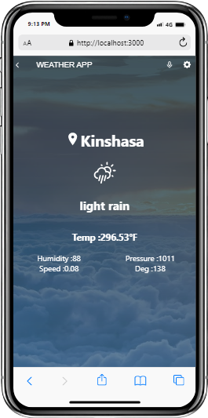

# Weather App

This React capstone project is about building a mobile web application to check a list of metrics (numeric values) that you will create making use of React and Redux. For our case, we selected Open weather API that provides numeric data about a weather then we built the webapp around it.

# Screenshots: 

#

## Built With

- Major languages: JAVASCRIPT | HTML | CSS 
- Major Library: ReactJS & Redux
- Technologies used : Git | Github | Linter | Jest

## Live video

[live presentation](https://www.loom.com/share/3f67f0b928794ae7b78e3eb1717221e4)

## Live Demo

[In progress]()

# Getting Started with Create React App

This project was bootstrapped with [Create React App](https://github.com/facebook/create-react-app).
To have the local version of this project in your local PC, first clone the project with: `git clone` https://github.com/RolandM99/weather-App.git,
then run the command `npm install` to update all packages locally.

## Available Scripts

In the project directory, you can run:

### `npm start`

Runs the app in the development mode.\
Open [http://localhost:3000](http://localhost:3000) to view it in your browser.

The page will reload when you make changes.\
You may also see any lint errors in the console.

### `npm test`

Launches the test runner in the interactive watch mode.\
See the section about [running tests](https://facebook.github.io/create-react-app/docs/running-tests) for more information.

### `npm run build`

Builds the app for production to the `build` folder.\
It correctly bundles React in production mode and optimizes the build for the best performance.

The build is minified and the filenames include the hashes.\
Your app is ready to be deployed!

See the section about [deployment](https://facebook.github.io/create-react-app/docs/deployment) for more information.

👤 **Author: **Roland Manful Mweze**

- GitHub: [Rolandm99](https://github.com/RolandM99)
- Twitter: [@Manfulmwez](https://twitter.com/ManfulMwez)
- LinkedIn: [Roland N. MWEZE](https://www.linkedin.com/in/roland-n-mweze-8b1045189/)

## 🤝 Contributors

Contributions, issues, and feature requests are welcome!

Feel free to check the [issues page](../../issues/).

## Show your support

Give a ⭐️ if you like this project!
